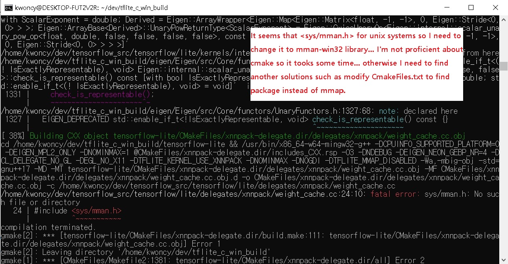
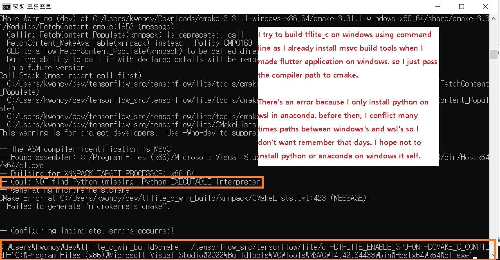

# Error history of cross build tensorflowlite_c shred library for windows on WSL2

I needed to build tensorflowlite_c library for windows platform. Since I already built it on WSL for linux. I though it would be easy because of I'm quite familiar with cmake now. But it was my mistake. I would do just download prebuilt one through online if I knew this will cost so much time to me. 

From in my previous experience, I already had built the tensorflowlite_c.dll using bazel, msys2 etc.  

At this time I decided to use only cmake and single compiler with cross compile methods...

***
* First error with wrong flags. This flag '/bigobj' is for windows compiler flag type.
* The compiler couln't parse it properly. Just accept it as a path not a flag.

***
* You can find jenerated make files like 'flags.make'. 
* The flags are for windows compiler like msvc. so erase it.

***
* There's weird error occured. the thread library is simply included standard library. Basically, this would not happen.

***
* I found there're two kinds of thread library types.

***
* Change simlink to posix version. Then the problem solved.

***
* sys/mman.h is for linux not windows.
* This might connect with mmap library. AFAK that package flag should be false for windows build configuration including other affected libraries. 
* AS I stucked this problem, I escape WSL environment and try again with windows host environment. Then I don't need to struggle with these hidden traps anymore.

***
* My system already installed visual studio tools for c++ because I've been trying to make flutter app. However, python is only installed on wsl. so I
tried to make simlink to call wsl's python interpreter.

***
* Fail to using wsl's python interpreter. It might not have compatibility.

***
* Install miniconda on Windows host. The problem solved.

***
* Require standard c++ 20 not 17. You can correct this error simply modify 17 flag to 20 in CMakeList.txt file. Please do not follow my struggles.

***
* I tried to modify that /std:c++17 flag.

***
* I found the flags in vcxproj files. Please do not follow this way you can just modify cmake file. It is way much of easy.

***
* Finally, success to build. But there're many problems left.

