# Error history of using prebuilt dll file on windows 

Once I succeed to build tensorflowlite_c.dll, befor I using it, I try to using another simple prebuilt dll library that I did same as on WSL2. Unfortunately, there were much errors. Luckly, I finally found how to fix tensorflowlite_c.dll symbol export problem. If you want to know that quickly, then please scroll down until the bottom and see several images.

***
* Using simple DLL test. this simple dll has two export function mydiff, mysum.
* The terminal output shows nothing eventhough codes and paths all correct.
* This is because of not using Native Tools Command Prompt.
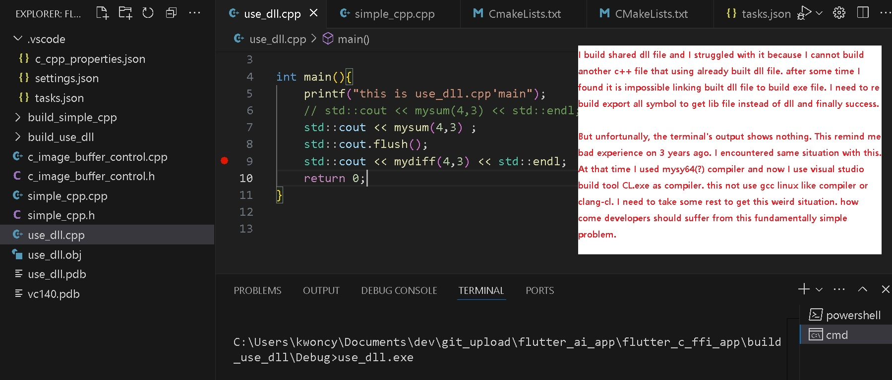

***
* Linking error shows cannot find function symbols. the code was not problem since I did same test on WSL2.
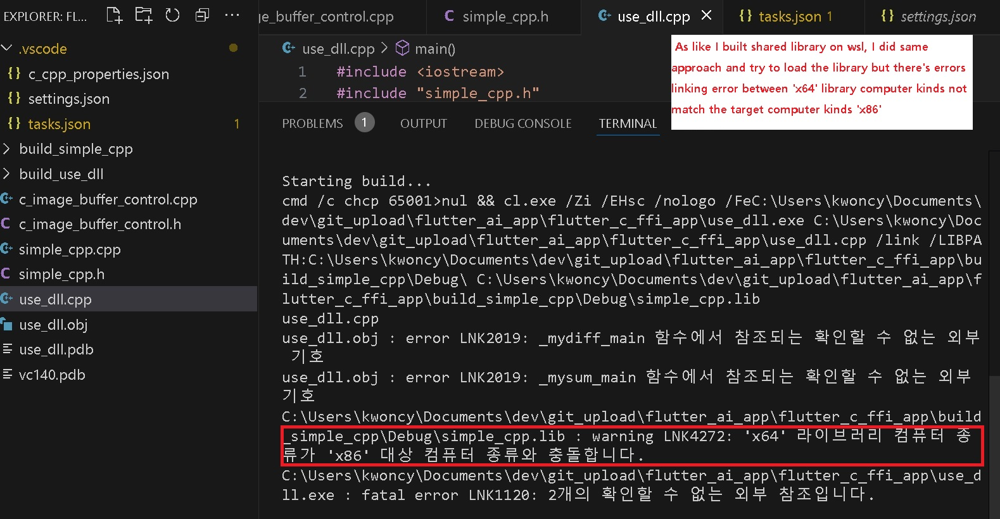

***
* The problem was caused from wrong prompt. Not to use x86 prompt. Wrong prompt would call different compiler version even if you specified compiler path correctly.

***
* You need to open correct version of prompt in which you can put command something like "code ."(this will run vscode on the corrunt directory)
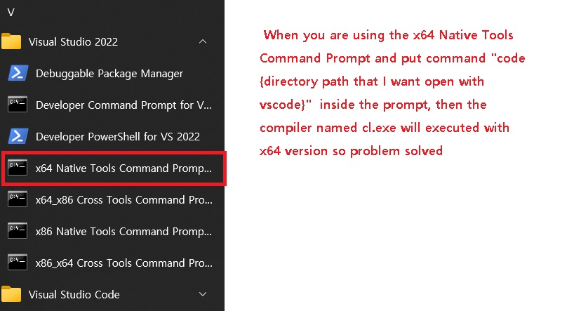

***
* After using simple.dll, I try to use tensorflowlite_c.dll that I built.
* Link failing keeps occur. 
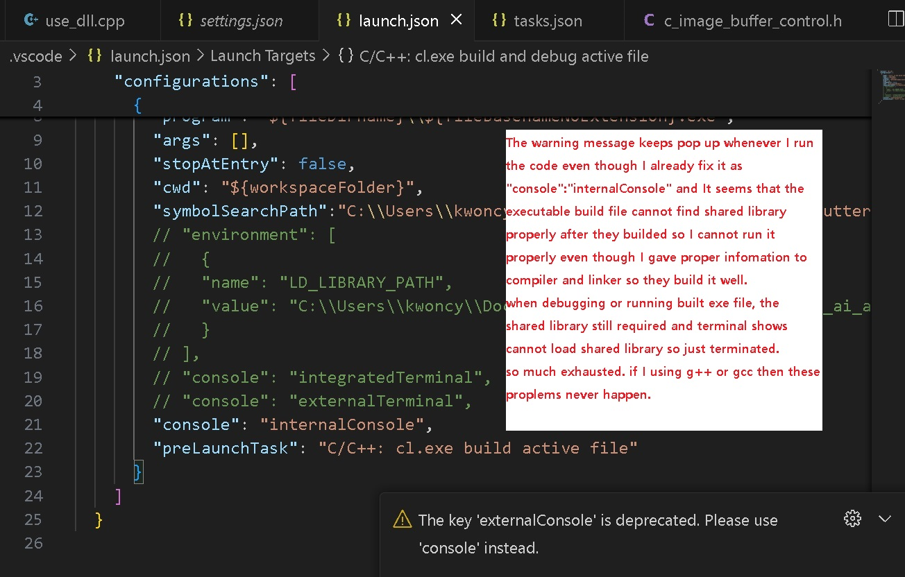

***
* This is not the problem of path or any other.
* The problem is the shared library that I built on my own.
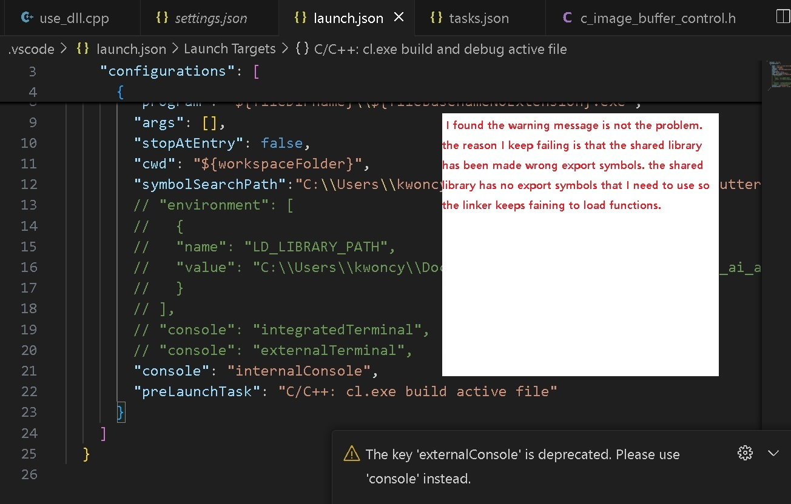

***
* The library has no export symbols that I needed.
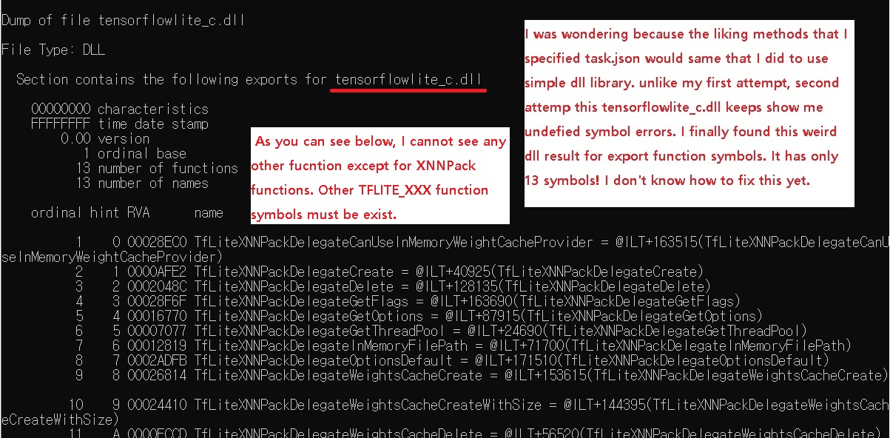

***
* Try to find to fix it. 
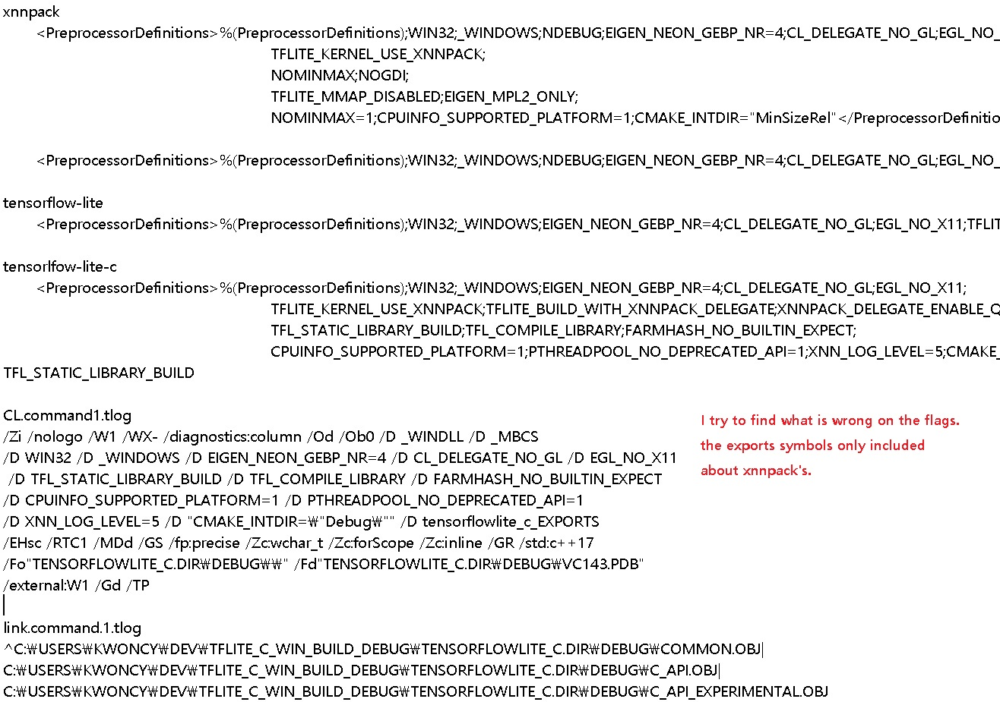

***
* Keep searching it. Finally I gave up to fix it. At this point, I cannot imagine that I eventually fix this export symbol problem.
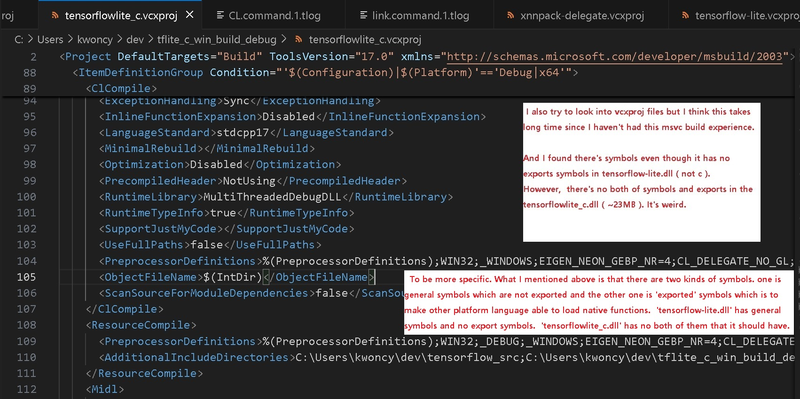

***
* Downloaded prebuilt tensorflowlite_c.dll. Since I spent so much time trying to fix it, I don't need consider official way which is using bazel, msys2 etc...
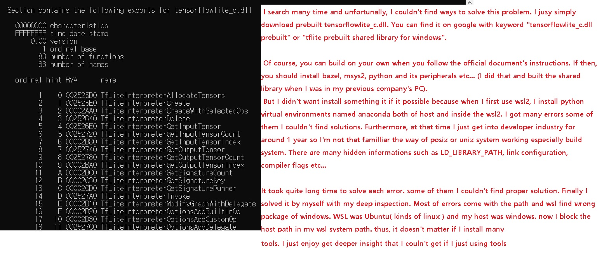

***
* After I downloaded tensorflowlite_c.dll library, I try to make another dll library to export just one function to easily use it. I just pass memory buffer then call native function once inside the new dll library. New dll library will call tensorflowlite_c.dll and process some deep_learning model and then give output to the memory buffer that I gave it first.
* But the result of new dll seems not to export symbol.
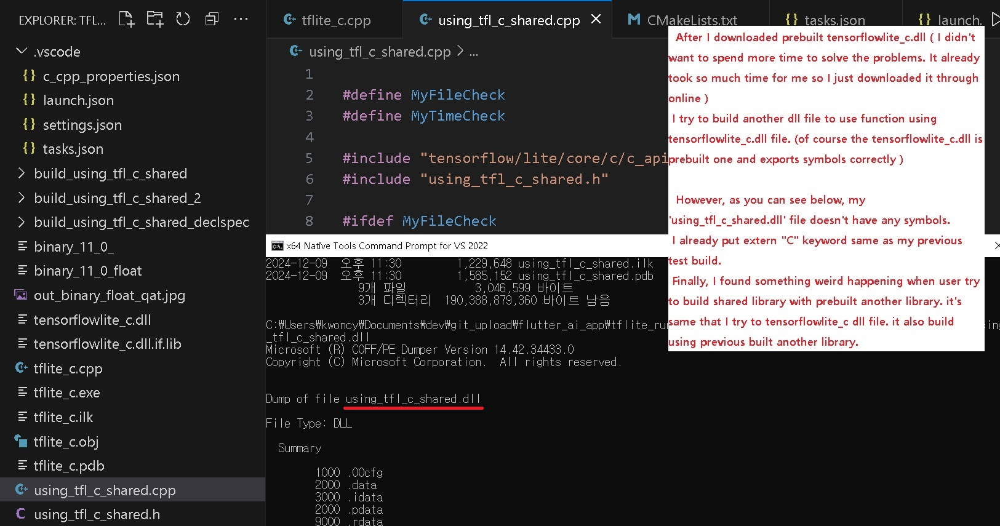

***
* It was weird. Because I did same thing to export symbols. Enclousing funcions with extern "C". My test shows correctly exported symbols.
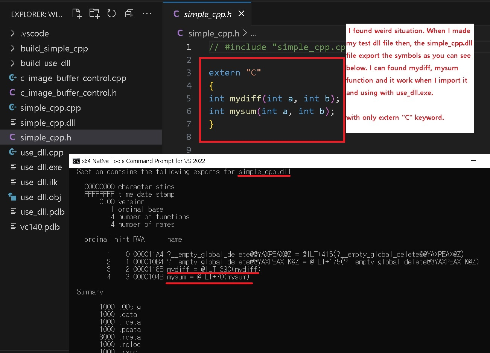

***
* Put keyword "__declspec(dllexport)" in front of the function. I finally found exported symbol correctly. It seems that the keyword must exist if I try to make shared library consecutively with prebuilt library.
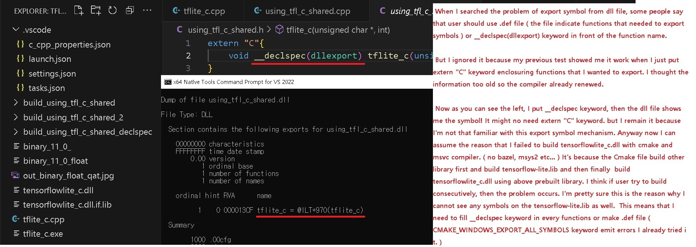

***
* Functions that should export symbol already have the keyword. It's written as a macro. So the problem is should be conditional statements.
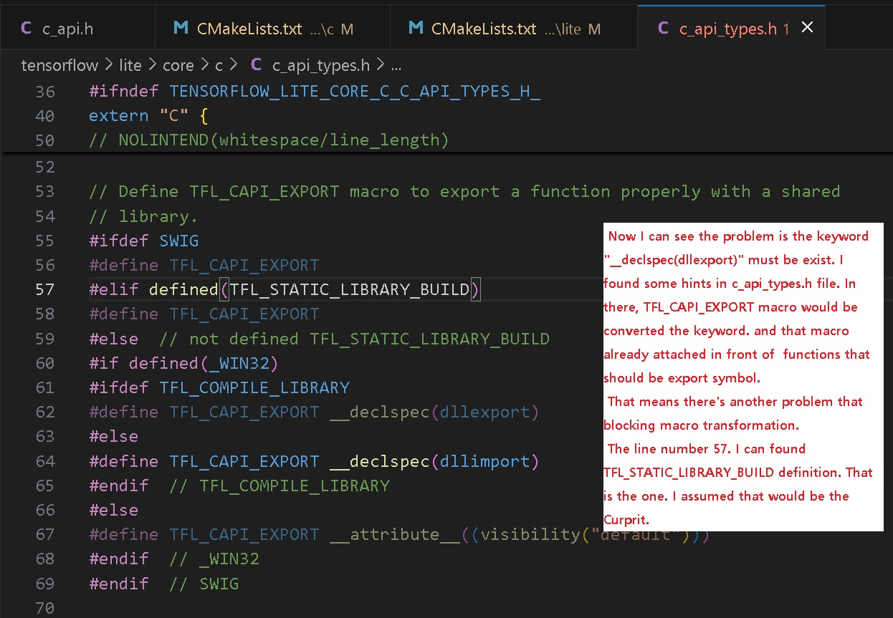

***
* I found "TFL_STATIC_LIBRARY_BUILD" definition added after "TFL_COMPILE_LIBRARY". This would make wrong results.
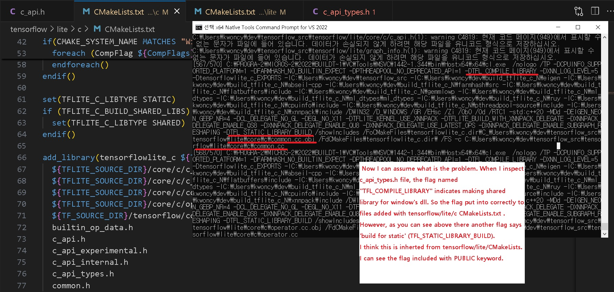

***
* In the CMakeLists file from tensroflow/lite, there's a inherit keyword "PUBRIC" which means definitions overflow to other library when building successively.
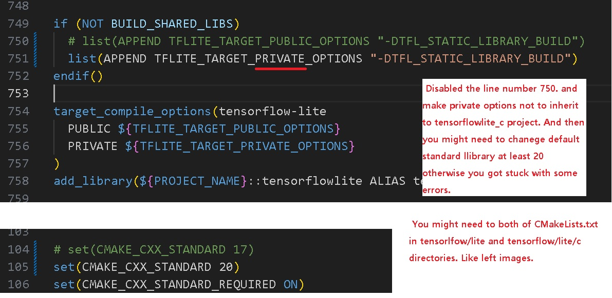

***
* I got it! Finally build tensorflowlite_c.dll with only cmake and msvc.
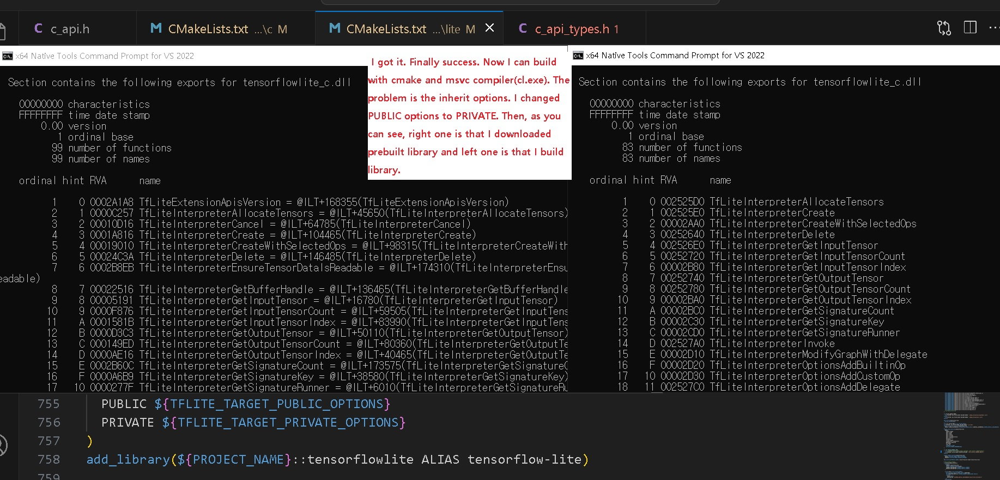
