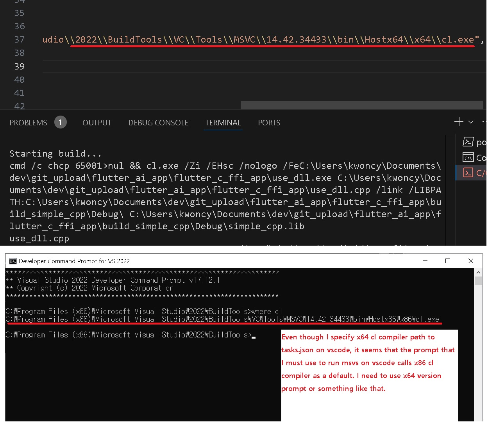

# Error history of using prebuilt dll file on windows 

Once I succeed to build tensorflowlite_c.dll, befor I using it, I try to use another simple prebuilt dll library that method I already did same as on WSL2. Unfortunately, there were much errors. Spending much time to solve them. 

While struggling, luckly, I finally found how to fix tensorflowlite_c.dll symbol export problem. If you want to know that quickly, then please scroll down until reach the bottom and see several images.

## 2024/12/16 My first pull request approved.
## 2025/1/06 I got email that my request merged #82798 into master. I made my first pull request on one of the famous library. And the bug I fixed had been over a year because I remember that around 1 year and half ago I failed at that time I almost new to cmake, unix system(WSL2) and build systems so I could'nt dare to try to fix it. 

***
* Using prebuilt my simple dll library to test. this simple dll has two export functions (mydiff, mysum).
* The terminal output shows nothing even though the codes and paths are all correct.
* This is because of not using Native Tools Command Prompt.

***
* Linking error message shows it cannot find function symbols. the code was not have any problems since I did same code to test on WSL2.

***
* The problem was caused by wrong prompt. Not to use x86 prompt. Wrong prompt would call different compiler version even if you specified compiler path correctly in configure files of .vscode folder.

***
* You need to open correct version of prompt in which you can put command something like "code ."(this will run vscode on the corrunt directory) 

***
* After passing the test to use simple.dll, I try to use tensorflowlite_c.dll that I built.
* Link failing keeps occur. 

***
* This is not the problem of path or any other.
* The problem is the shared library that I built itself.

***
* The library has no export symbols that I needed.

***
* Try to find to fix it. 

***
* Keep searching it. Finally I gave up to fix it. At this point, I cannot imagine that I eventually fix this export symbol problem.

***
* Downloaded prebuilt tensorflowlite_c.dll. Since I spent so much time trying to fix it, I don't need consider official way which is using bazel, msys2 etc...

***
* After I downloaded tensorflowlite_c.dll library, I try to make another dll library to export just one function to easily use it. I just pass memory buffer then call native function inside the new dll library once. Then the new dll library will call tensorflowlite_c.dll, process some deep_learning models and then finally return output to the memory buffer that I gave it first.
* But the result of new dll seems not to export symbol at all.

***
* It was weird. Because I did same thing to export symbols. Enclousing funcions with extern "C". My test shows simple.dll correctly exported it's symbols.

***
* Put keyword "__declspec(dllexport)" in front of the function. I finally found exported symbol correctly. It seems that the keyword must exist if I try to make shared library consecutively with another prebuilt library.

***
* It seems that the functions that should export symbol already have the keyword in the official github. It's written as a macro. So the problem is should be conditional statements.

***
* I found "TFL_STATIC_LIBRARY_BUILD" definition added after "TFL_COMPILE_LIBRARY". This would make wrong results.

***
* In the CMakeLists file from tensroflow/lite, there's a inherit keyword "PUBRIC" which means definitions overflow to other library.
* Prevent not to inherit 'tensorflow/lite definitions' to 'tensorflow/lite/c definitions'.
* Also you might need to modify both of CMakeLists files in tensorflow/lite and in tensorflow/lite/c.

***
* I got it! Finally build tensorflowlite_c.dll with cmake, compiler and python interpreter.

***
* My first pull request. It's monumental.

***
* My first pull request approved! I'm glad to contribute to famous library.

