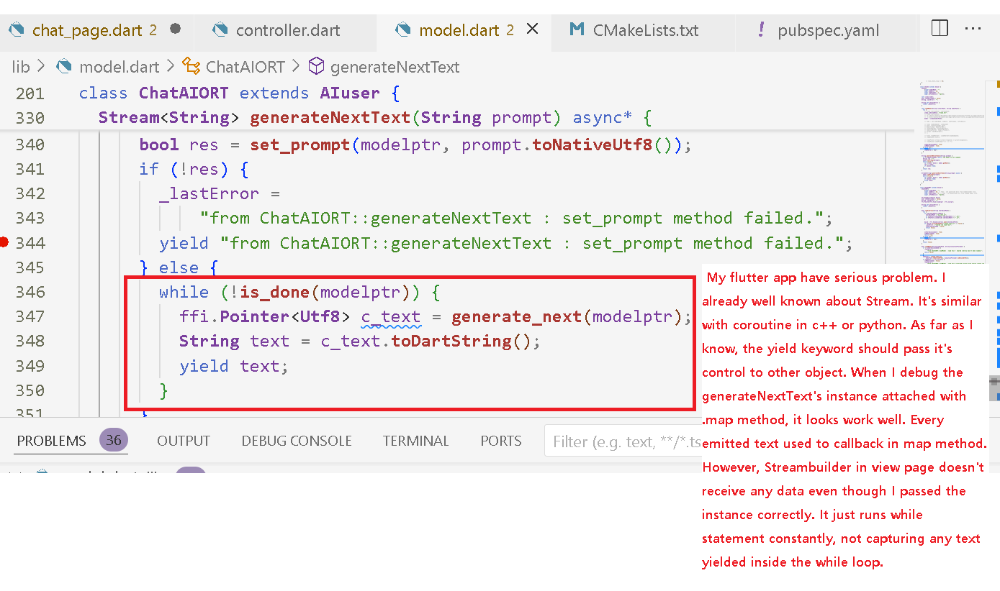
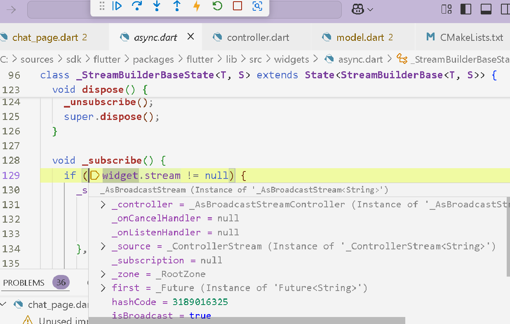
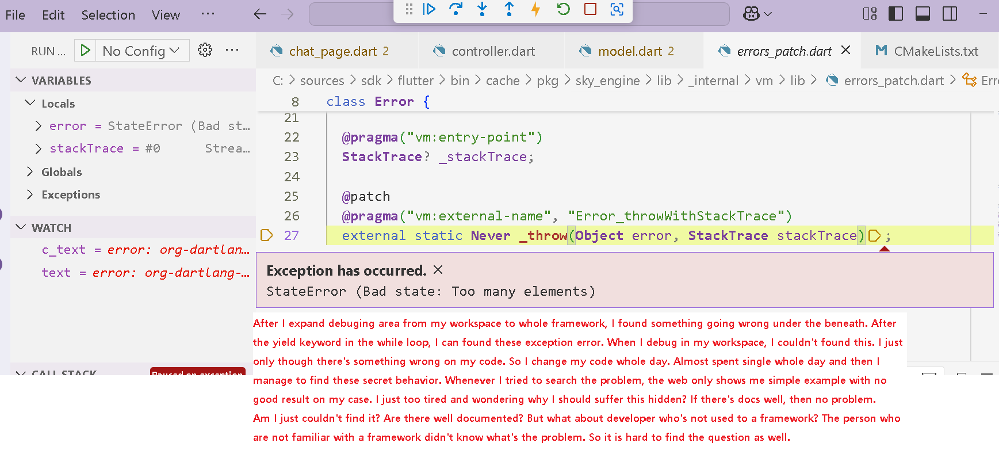
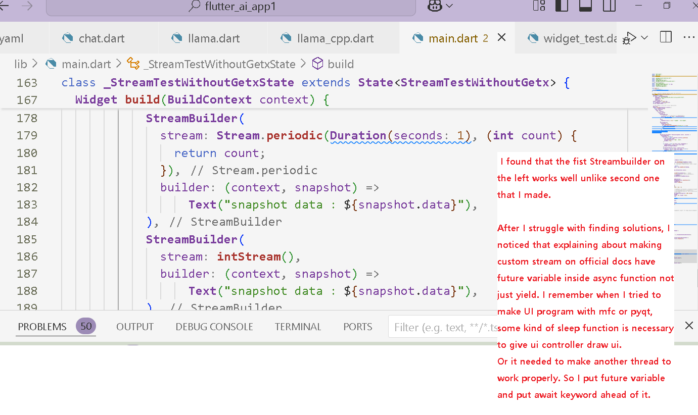
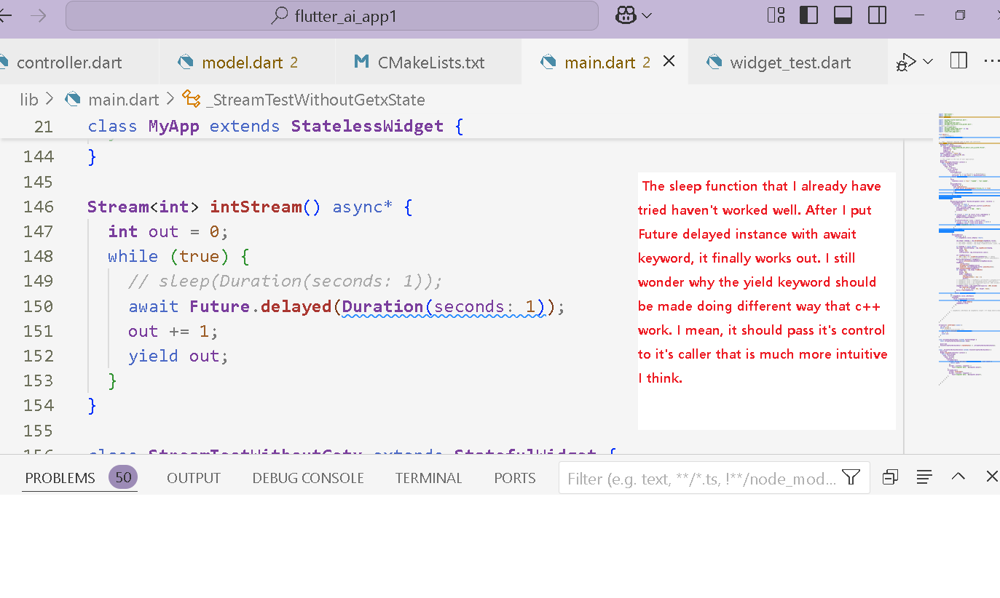
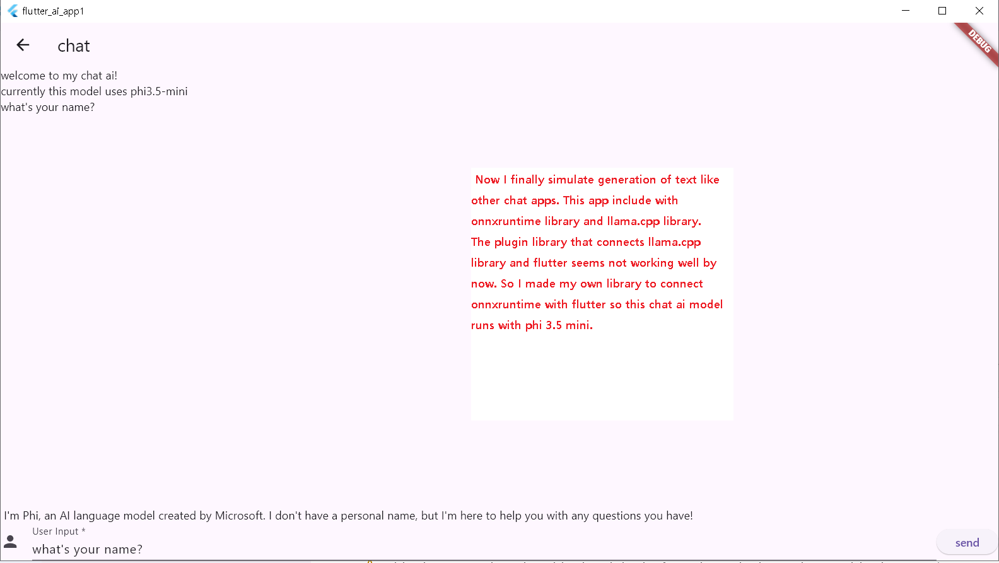

# Using onnxruntime llm model and integrate it into flutter.
Simulating token generation require kinds of coroutine. The flutter's one quite different with python or c++. I had struggled with solving some errors.

***
* My coroutine function not work well even after I checked the listener that attached this function work well.

***
* First time I faced error it seems the streamcontroller needed to be broadcast one to get multiple listener to use streambuilder. But it still not working.

***
* I expand debugging area from my workspace to almost whole libraries. and I found something went wrong.

***
* I made two functions to check what is wrong.

***
* I finally found what's the problem. It works quite differently with other languages. And this information I could'n get easily.

***
* My app now able to simulate print each tokens whenever each of them generated.

