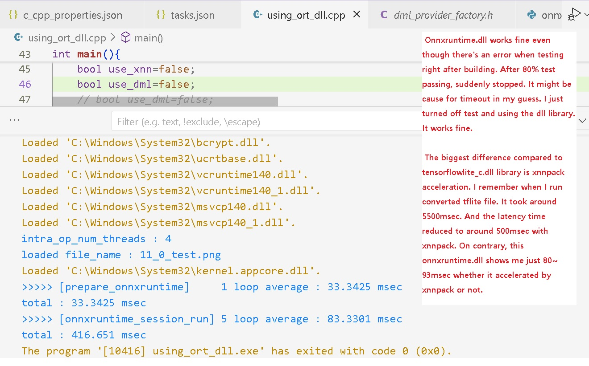
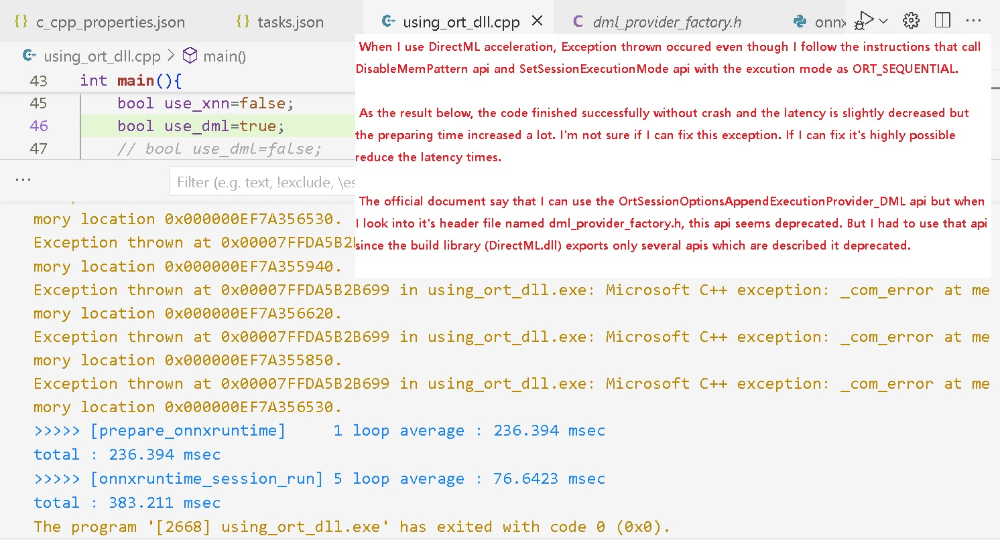

Using onnxruntime with dml and xnnpack for desktop pc.
Xnnpack successfully adapted. Unlike tensorflowlite_c library, the latency time seems not to be changed. And the latency time significantly reduced compared to with tensorflowlice_c library. Tensorflowlite_c's latency was 5000msec without xnnpack 500msec with xnnpack. Since this test went through my notebook, I cannot test gpu with tensorflowlite_c (not support). Unlike tensorflowlite_c, the onnxruntime shows me less than 100msec whether xnnpack adapted or not. 
I can assume that the test done on AMD APU and windows os so the onnxruntime library is more optimized on desktop pc. This results not on edge devices like mobile and roc.

***
* Latency time almost same whether xnnpack adapted or not.

***
* Inference done with dml acceleration producing a lot of exceptions.

