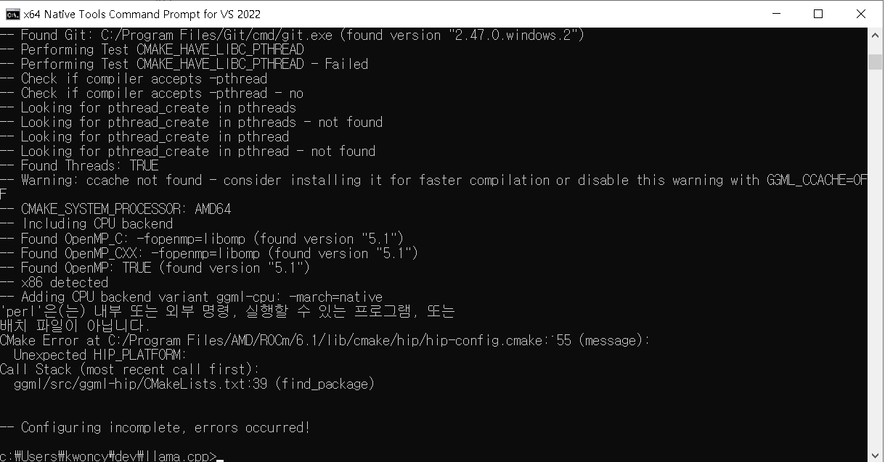
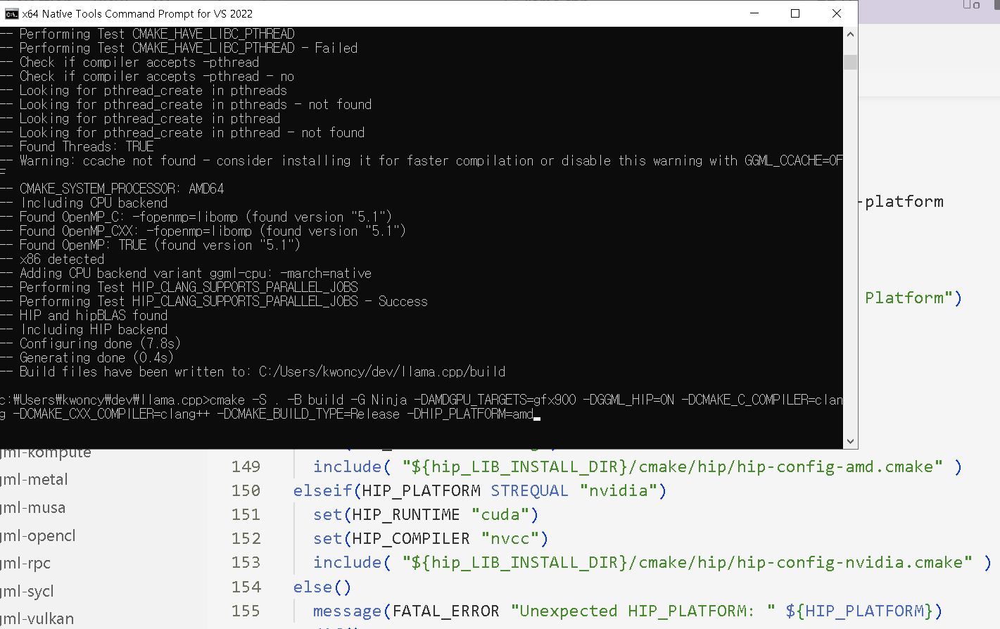
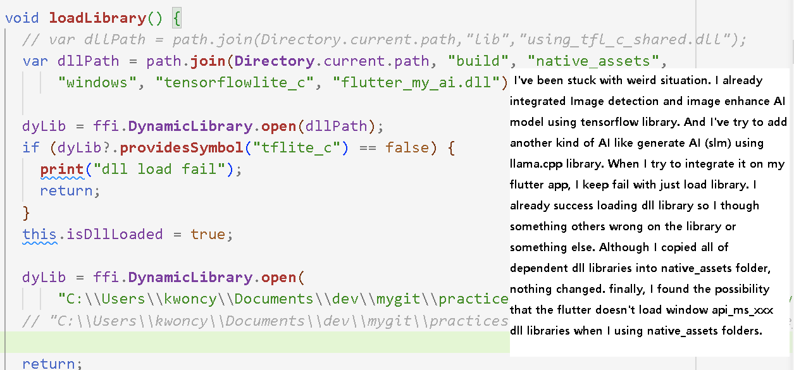

# Integrating generate-ai (sml)
After I integrate object detection AI model and image enhance AI model on my flutter app, I hope add another kind of AI model such as chatGPT.
That kind of model is quite huge so it's quite hard to run on edge device. It's not suprise that major frameworks are not that interest running llm models on edge device so not much information. I recently found onnxruntime's examples so I'll try it later. Before I found that one, I just looked into llama.cpp library and try to integrated it. 
Many errors that I didn't put this repo suffering me so much times.

***
* I tried to using my laptop's integrated gpu(igpu,apu) through rocm acceleration. I succeed it another framework. But this library not allow me to build.

***
* After I inspect the cmake files, I found a condition statement require HIP_PLATFORM value. I put it off.

***
* Unfortunately, unlike success on other framework, it looks like this library not allow me to use integrated gpu. I try several times by changing some values such as HSA_OVERRIDE_GFX_VERSION.
_error1.png)

***
* I just build it only cpu acceleration. And it runs well when I put small model such as qwen-1.5B. Unfortunately, I stuck a lot of time just loading dll library on my flutter app. First time I though it's caused another issue because I already succeed when I integrated another model using tensorflowlite_c. Eventhough I added all kind of dependent dll libraries in native assets folder, it's not successful.now I found that the flutter framework work another way if the dll library require window dll libraries such as api-ms-win-crt-runtime-l1-1-0.dll.
