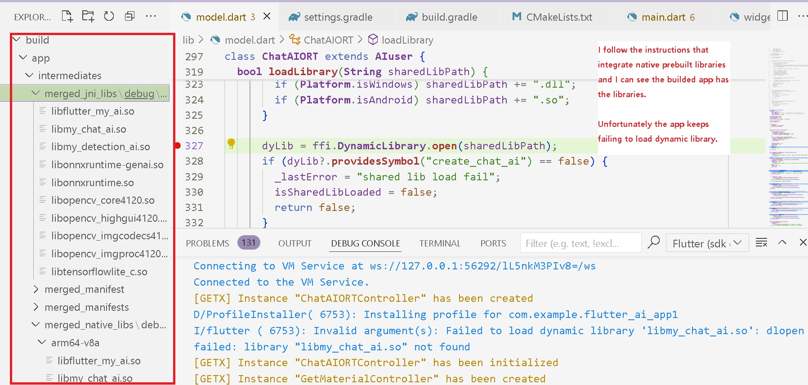

# Build and test app for android.
There are several errors from the start. I needed to update gradle and some code by myself. Unfortunately, even I follow instructions that I found on the Internet. dlopen keeps failing. First time I think it was my fault. However, I found someone stuck error similar with me. It seems that the problem is flutter itself.

*** 
* Errors from the start to build android. flutter doctor shows me no problem.

***
* Prebuilt library open fail. It seems that jniLibs merged well but the app failed to load.

***
* I found someone suffered similar problem. When I try to his code, I fail to dlopen even debug mode(he said he's success)
