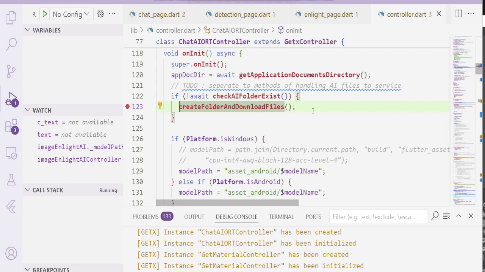
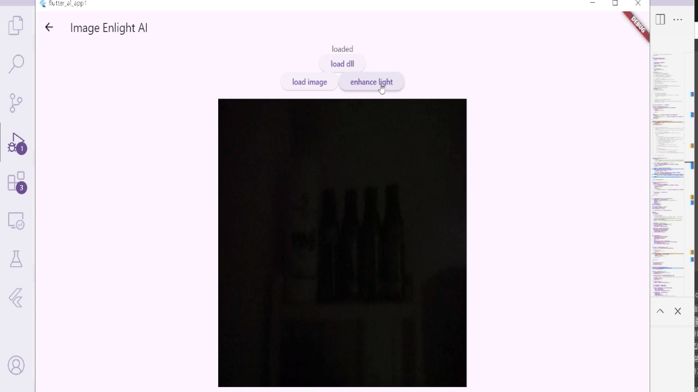
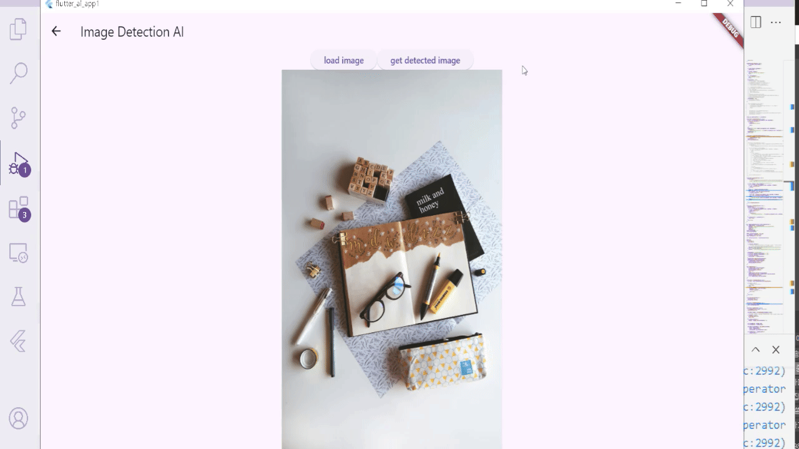

# Flutter AI app 
## (sLM + ONNX_Runtime + TFLite + c++ backend + object detection + image enhance)
## (This is focus on-device run without internet access nor python)
  
* You can see demo and full video link below
  
* Chat AI running as like other chatbot without waiting generation done.

  
* Image Enhance AI with very small model, less than 1MB.

  
* Object detection AI with recent state-of-art real time detection
* (The model hasn't findtuned, been Quantized 8int.)
* (I just downloaded the model and did PTQ. the accuracy is not good. finetuning and QAT will show better accuracy.)

  

full demo video - https://youtu.be/D--Q8_ORoiE

Flutter app integrated with AI backend(tflite, onnxruntime) and able to run chat AI without internet.

This app is for my personal fortpolio to show how it works.

The majority backend module made by c++ for realtime serving.

This app is able to run from light weight small AI model for object detection and image enhancement. 

Small LLM generate model also integrated with fast response on my laptop(without gpu, only cpu).

You can make your own AI model or just download from the open-source with its weight if you don't have enough training resources.
Convert AI model from to onnx format if you want to use onnxruntime backend or tflite for using LiteRT(previous tensorflow-lite).

Build it with backend libraries and link to the flutter through ffi.dart.

You can see some hints how to make this app on the below url.
https://github.com/kwoncy2020/kwoncy2020/tree/main/practices/flutter_ai_app1

And also able to see which kinds of errors I've been through. (the majors I recorded without trivial errors)
https://github.com/kwoncy2020/kwoncy2020/tree/main/error_history

If you want to see how I used backend runtime libraries, Then take a look into below urls. (the codes are not decent since I prefer to leave what I tried so that I can come up with previous my try easily. This is for my practice after all)
https://github.com/kwoncy2020/kwoncy2020/tree/main/practices/tflite_runtime
https://github.com/kwoncy2020/kwoncy2020/tree/main/practices/using_ort_dll

